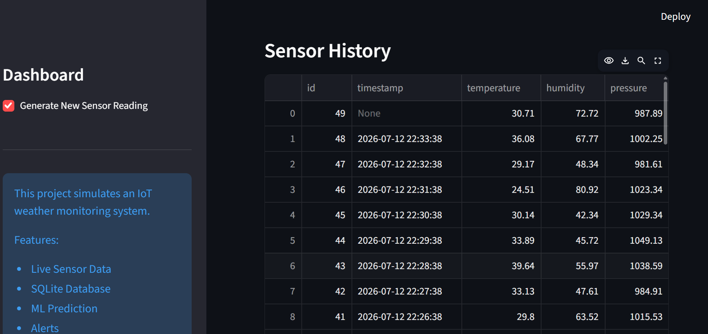
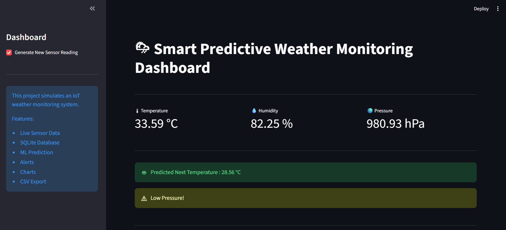

# 🌦 Smart Predictive Weather Monitoring Dashboard

## Overview

A Python-based IoT Weather Monitoring Dashboard built using Streamlit. The project simulates weather sensor readings, stores them in an SQLite database, visualizes trends, and predicts future temperature using Machine Learning.

## Features

- Live Weather Monitoring
- Temperature, Humidity & Pressure Tracking
- SQLite Database Storage
- Machine Learning Temperature Prediction
- Weather Alerts
- Interactive Dashboard
- CSV Export

## Technologies Used

- Python
- Streamlit
- SQLite
- Pandas
- Matplotlib
- Scikit-learn

## Project Structure

```
Smart-Weather-Monitoring/
│
├── app.py
├── database.py
├── sensor.py
├── predict.py
├── requirements.txt
├── weather.db
├── README.md
└── screenshots/
```

## Installation

```bash
pip install -r requirements.txt
streamlit run app.py
```

## Future Improvements

- Real IoT Sensor Integration
- Cloud Database
- Email Alerts
- Mobile Dashboard
- Live Deployment
## Dashboard Preview

### Main Dashboard



### Weather Charts

